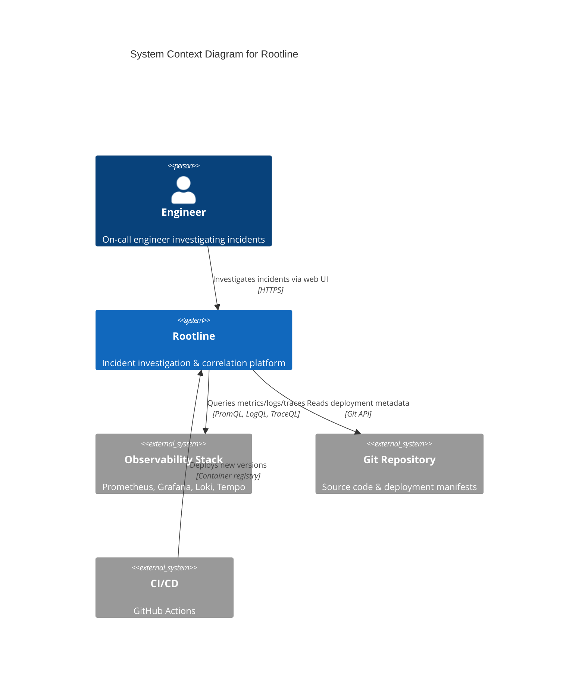
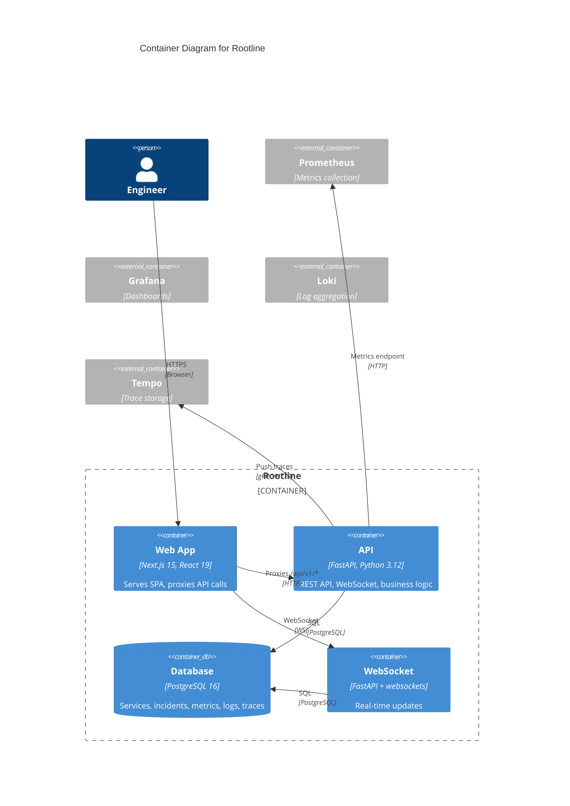
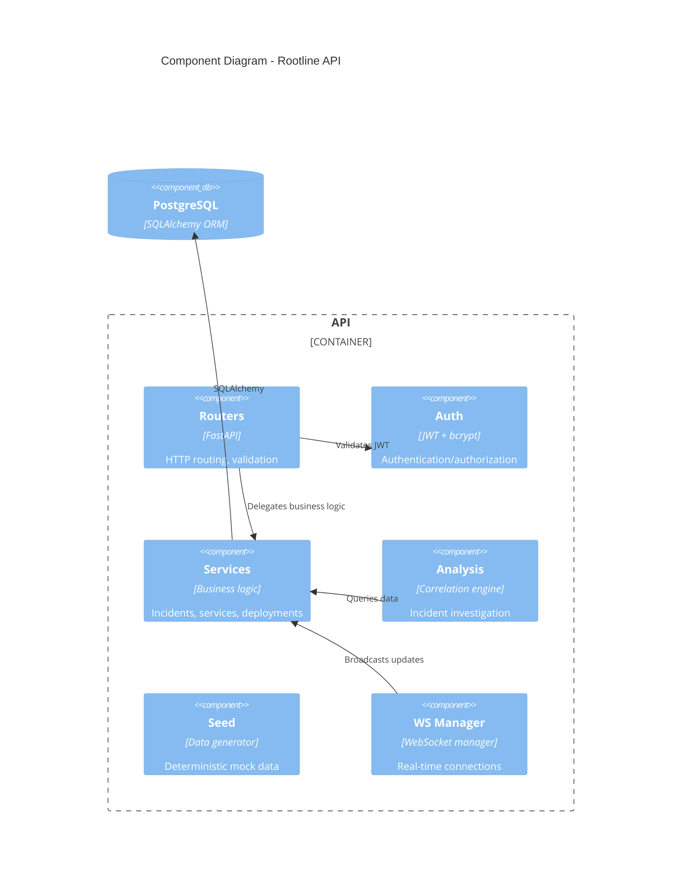

# Architecture Documentation

This directory contains architecture diagrams and documentation for Rootline.

## C4 Model Diagrams

### System Context (Level 1)



### Container Diagram (Level 2)



### Component Diagram - API (Level 3)



## Deployment Architecture

```mermaid
C4Deployment
title Deployment Diagram

Deployment_Node(k8s, "Kubernetes Cluster") {
    Deployment(web, "web", "Next.js", "3 replicas")
    Deployment(api, "api", "FastAPI", "3 replicas")
    Deployment(db, "postgres", "PostgreSQL", "1 primary + 1 replica")
    Deployment(prom, "prometheus", "Prometheus", "1 replica")
    Deployment(grafana, "grafana", "Grafana", "1 replica")
}

Rel(web, api, "Internal service", "HTTP")
Rel(api, db, "Internal service", "PostgreSQL")
```

## Technology Stack

| Layer    | Technology           | Version           |
| -------- | -------------------- | ----------------- |
| Frontend | Next.js (App Router) | 15.x              |
| Frontend | React                | 19.x              |
| Frontend | TypeScript           | 5.x               |
| Frontend | TanStack Query       | 5.x               |
| Frontend | Tailwind CSS         | 4.x               |
| Backend  | FastAPI              | 0.115+            |
| Backend  | Python               | 3.12              |
| Backend  | SQLAlchemy           | 2.0               |
| Backend  | PostgreSQL           | 16                |
| Backend  | Alembic              | 1.13              |
| Backend  | WebSockets           | websockets 13     |
| Backend  | Prometheus           | prometheus-client |
| Backend  | Logging              | structlog         |
| Infra    | Docker               | 24+               |
| Infra    | Kubernetes           | 1.28+             |
| CI/CD    | GitHub Actions       | -                 |

## Data Flow

### Incident Creation

1. Engineer creates incident via Web UI
2. Web → API `POST /incidents` (JWT auth)
3. API validates, creates incident in PostgreSQL
4. API broadcasts via WebSocket to connected clients
5. WebSocket clients receive real-time update

### Real-time Metrics

1. Frontend connects to `/ws/services/{id}/metrics`
2. API streams metric updates via WebSocket
3. Frontend updates charts in real-time

### Incident Analysis

1. Engineer clicks "Analyze" on incident
2. API `POST /incidents/{id}/analyze`
3. Analysis service correlates:
   - Recent deployments to affected services
   - Metric anomalies (error rate, latency spikes)
   - Error logs and traces
   - Dependency health
4. Returns hypotheses with evidence/counter-evidence
